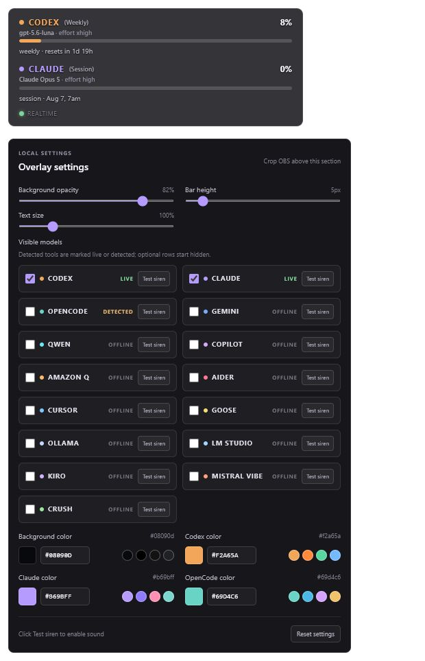
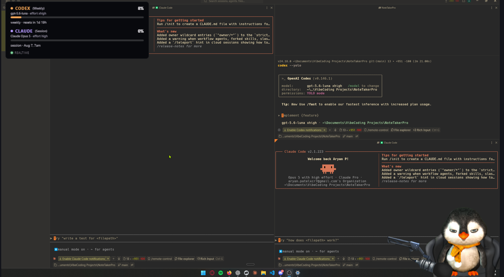
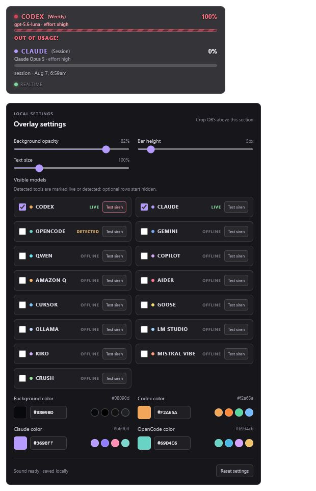

# AI Usage Monitor for OBS

<p align="center">
  <strong>A lightweight localhost AI usage tracker and OBS Browser Source overlay for Codex, Claude, and local AI coding agents.</strong>
</p>

<p align="center">
  <a href="https://github.com/aryanpxcr7/AI-Usage-Monitor-OBS/issues"></a>
  
</p>

<p align="center">
  
</p>

> Captured from the current localhost page. Usage values and detected tools reflect the local machine running the app.

## Real OBS example

<p align="center">
  
</p>

> Actual OBS Browser Source usage. The overlay stays in the corner while the rest of the scene remains visible.

## When usage runs out

<p align="center">
  
</p>

When a visible agent reaches 100%, its bar switches to a red dead state, shows **OUT OF USAGE!**, and plays a short warning beep/siren. Use the **Test siren** button in settings to preview the alert.

## What it does

- Tracks Codex and Claude 5-hour session and weekly quotas in a compact AI limit overlay.
- Shows live session and weekly usage percentages for Codex and Claude.
- Displays reset information, model names, and effort levels.
- Detects supported local AI tools and lets you choose which rows to show.
- Includes a limit alert beep/siren and OBS-friendly appearance settings.

It works as a local AI quota tracker, coding-agent usage dashboard, or transparent OBS stream overlay without sending provider credentials to a hosted service.

## Run it locally

1. Clone the repository and open the project folder.

   ```bash
   git clone https://github.com/aryanpxcr7/AI-Usage-Monitor-OBS.git
   cd AI-Usage-Monitor-OBS
   ```

2. Install dependencies.

   ```bash
   npm install
   ```

3. Start the local app and usage bridge.

   ```bash
   npm run start:local
   ```

4. Open the localhost URL printed in the terminal.

5. In OBS, add a **Browser Source** using the same URL. Crop the source below the bars so the settings stay out of your scene.

## Supported detection

The bridge checks for Codex, Claude, OpenCode, Gemini CLI, Qwen Code, Copilot CLI, Amazon Q, Aider, Cursor Agent, Goose, Ollama, LM Studio, Kiro CLI, Mistral Vibe, and Crush.

Codex and Claude provide 5-hour session and weekly percentage usage. Other detected tools show their model/configuration when available and do not display made-up quota percentages.

## Contributing

This project is open source. To add another local agent, add its command detector to `scripts/usage-bridge.mjs` and its label/color to `AGENT_CONFIG` in `app/page.tsx`.
